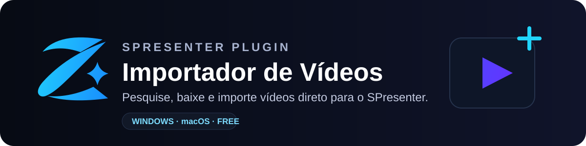
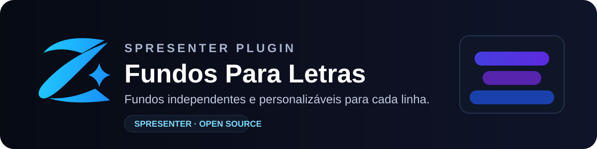
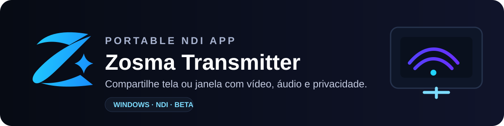
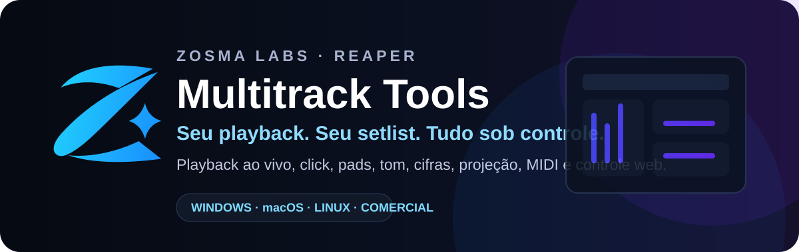

 

**Software independente, plugins e ferramentas para transformar ideias em soluções.**

---

## Produtos open source

Automatiza os fundos da Bíblia no SPresenter por **perfil, setlist ou programação**, deixando cada culto pronto sem troca manual de tema.

[Repositório](https://github.com/zosmalabs/fundos-por-culto-spresenter) · [Tutorial](https://youtu.be/tORfqEOUnok)

 

Pesquisa, baixa e importa vídeos para o SPresenter com **processamento local de mídia** e suporte a Windows e macOS.

[Repositório](https://github.com/zosmalabs/importador-videos-spresenter) · [Tutorial](https://youtu.be/kxIf_o-fvas)

 

Cria fundos independentes e personalizáveis para linhas de letras, com controles de **cor, opacidade, espaçamento, borda e arredondamento**.

[Repositório](https://github.com/zosmalabs/fundos-para-letras-spresenter)

 

Transmissão NDI portátil de monitor ou janela, com **vídeo, áudio, modos de proteção, privacidade e opções de desempenho**.

[Repositório](https://github.com/zosmalabs/zosma-transmitter)

---

## Produto em destaque

Uma central de controle para **REAPER** voltada a playback ao vivo, com setlists, regiões, loops, pads, click, alteração de tom, cifras, projeção, automações, MIDI e controle web em uma única ferramenta.

**Windows · macOS · Linux** · Licença vitalícia · 1 máquina · Atualizações incluídas

[**Conhecer o Multitrack Tools →**](https://zosma.com.br/multitrack-tools/)

---

## Tutoriais e recursos

Além do software, publicamos demonstrações e conteúdo prático sobre as ferramentas e os fluxos de trabalho em que elas são usadas.

[Fundos por Culto](https://youtu.be/tORfqEOUnok) · [Importador de Vídeos](https://youtu.be/kxIf_o-fvas) · [Saídas HTML do SPresenter](https://youtu.be/bWww7y3Sa5c) · [Preparação de multitracks](https://youtu.be/S2FhgK97Uoc)

 

### Ideias transformadas em software.

[**zosma.com.br**](https://zosma.com.br)

